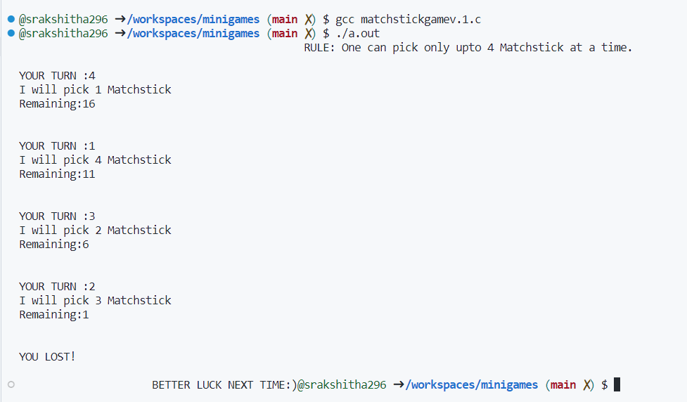

 <!DOCTYPE>
 <html>
      <head></head>
          <body>
               <h1>Minigames</h1>
               <h3>This repository consists of games that are devolopped using C language.</h3>
                    

                         In this game user and the computer has to pick the matchstick simultaneously.
                         The one who has to pick the last 1 matchstick will lose the game.
                         But more than 4 matchsticks cant be chosen at a time. Doing so will end the game!
                    

                     
          </body>
</html>